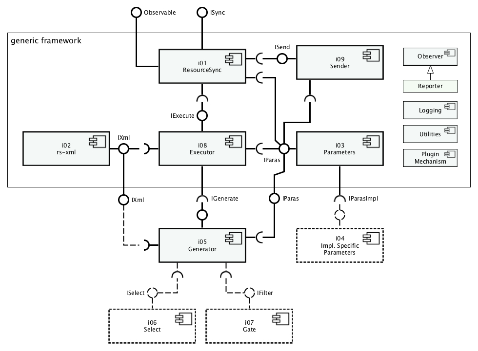

# py-resourcesync


Core Python library for ResourceSync publishing

---
- Source location: [https://github.com/resourcesync/py-resourcesync](https://github.com/resourcesync/py-resourcesync)
- In case of questions [contact here](https://github.com/resourcesync/py-resourcesync/issues/new).

---

## Introduction
The [ResourceSync specification](http://www.openarchives.org/rs/1.0.9/resourcesync) describes 
a synchronization framework for the web consisting of various capabilities that allow third-party systems to remain synchronized with a server's evolving resources.
More precisely the ResourceSync Framework describes the communication between `source` and `destination` aimed at
synchronizing one or more resources. Communication uses `http` and an extension on 
the [Sitemap protocol](http://www.sitemaps.org/protocol.html), an xml-based format for expressing metadata relevant for synchronization.

The software in `py-resourcesync` library handles the `source`-side implementation of the framework.
Given a bunch of resources it analyzes these resources and the differences over time and creates
the necessary sitemap-documents that describe the resources and the changes. 

## Getting Started
### Installation from Source

Clone or downoad the source code and issue the install
command from the root directory of this project.

**Note**: This library requires Python >3.5 and is not compatible with Python 2.\* .
```
$ cd your/path/to/py-resourcesync
$ python3 setup.py install
```

### Resource Metadata

`py-resourcesync` will have to be provided with the necessary metadata 
 of the resources in a server so that it can generate 
the appropriate ResourceSync documents. For this purpose, the library provides a plugin-like 
 interface so that the user can hook up any source of metadata with `py-resourcesync`. The 
 metadata source could be a filesystem, a database like MySQL or elasticsearch, an OAI-PMH 
 endpoint, or a REST API. This plugin interface is called a `Generator`, and 
 Generators for common metadata stores like the ones mentioned above will be implemented in the near future. 
 
 A very basic example is provided in the [`EgGenerator`](resourcesync/generators/eg_generator.py) 
 class that shows how a plugin can be implemented. The generator plugin file will have to be present in the 
 [`Generator`](resourcesync/generators/) directory. The generator will have to sub-class the 
 `Generator` class and must implement the `generate` method. The `generate` method must return 
 an iterable or an iterator of 
 [resync/Resource](https://github.com/resync/resync/blob/master/resync/resource.py) instances.

### Generating ResourceSync Documents

Once the Generator plugin is hooked up to provide the resource metadata to the library,
 the ResourceSync documents can be generated by invoking the `execute()` 
 method in the `ResourceSync` class 
 and providing it with the name of the generator class. 
 
```python
>>> from resourcesync.resourcesync import ResourceSync
>>> rs = ResourceSync(generator="EgGenerator")
>>> rs.execute()
```

The execute method will in turn invoke the `generate()` method of the 
`EgGenerator` and obtain the list of resource metadata.

The library can be told what type of ResourceSync document to produce by 
passing the name of the resource type to the parameter `strategy`. 
The library currently supports 
`resourcelist`, `new_changelist`, and `inc_changelist`.

```python
>>> from resourcesync.resourcesync import ResourceSync
>>> rs = ResourceSync(generator="EgGenerator", 
                      strategy="resourcelist")
>>> rs.execute()
```

By default, the generated resourcesync documents are saved in a folder 
called `metadata` in the home directory of the user. The `resource_dir`
and the `metadata_dir` parameters can be used to change these. 

```python
>>> from resourcesync.resourcesync import ResourceSync
>>> rs = ResourceSync(generator="EgGenerator",
                      strategy="resourcelist",
                      resource_dir="/var/metadata/",
                      metadata_dir="resourcesync")
>>> rs.execute()
```
Now the generated ResourceSync documents will be stored in 
`/var/metadata/resourcesync`.

A brief explanation of all the available parameters are provided in the 
Parameters section below. 

## Architecture Overview



_Fig. 1. Overview of the main features of `py-resourcesync`._

In essence py-resourcesync is a one-class, one-method library: class `ResourceSync`, method `execute`.
But there is more:

- `Parameters` control the conditions under which the execution takes place. Multiple sets of parameters can
be saved as configurations and restored from disk.
- The set of resources that will be synchronized can be selected and filtered using pluggable component
called `Generator`. The user can easily implement ways to select and filter metadata for resources for your system.
    - The `execute` method in the `ResourceSync` class will invoke the `generate` function of the custom 
    generator to retrieve the resource metadata. The custom generator must be a subclass of the `Generator` class.
    - The generator is responsible for selecting and filtering the necessary resources and gathering the 
    required metadata needed to build the ResourceSync documents.
    - The generator must return a list of [resync/Resource](https://github.com/resync/resync/blob/master/resync/resource.py) 
    instances when the called by the `ResourceSync.execute` method.
- The chosen `Strategy` determines what kind of process will do the synchronization. At the moment there are `Executors`
that produce _resourcelists_, _new changelists_ or _incremental changelists_.

A set of parameters, known as a configuration, can precisely define a set of resources, the selection and filter
mechanisms, the publication strategy and where to store the resourcesync metadata. Dedicated configurations can be defined
for multiple sets of resources and published in equal amounts of _capabilitylists_. A configuration can be saved on disk,
restored and run with a minimum effort. This makes `py-resourcesync` the ideal library for scripting a publication
strategy that will serve multiple groups of consumers that may be interested in different sets of resources offered
by your site.


## Parameters


`config_name`: The name of the configuration to read. If given, sets the current configuration. (str)

`resource_dir`: The local root directory for ResourceSync publishing (str)
    
`metadata_dir`: The directory name for ResourceSync documents (str)
    
`description_dir`: Directory where a version of the description document is kept (str)
    
`url_prefix`: The URL-prefix for ResourceSync publishing (str)

`document_root`: The directory from which the server will serve files (str)

`strategy`: Strategy for ResourceSync publishing (str | int | class `~resourcesync.parameters.enum.Strategy`)

`generator`: Generator for ResourceSync publishing (str)

`plugin_dir`: Directory where plugins can be found (str)

`max_items_in_list`: The maximum amount of records in a sitemap (int, 1 - 50000)

`zero_fill_filename`: The amount of digits in a sitemap filename (int, 1 - 10)

`is_saving_pretty_xml`: Determines appearance of sitemap xml (bool)

`is_saving_sitemaps`: Determines if sitemaps will be written to disk (bool)

`has_wellknown_at_root`: Where is the description document {.well-known/resourcesync} on the server (bool)
